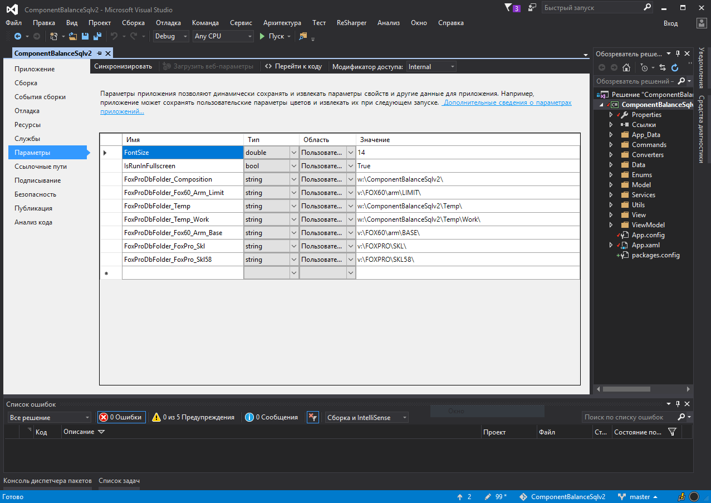
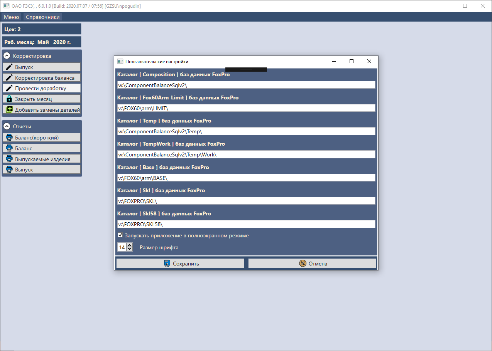
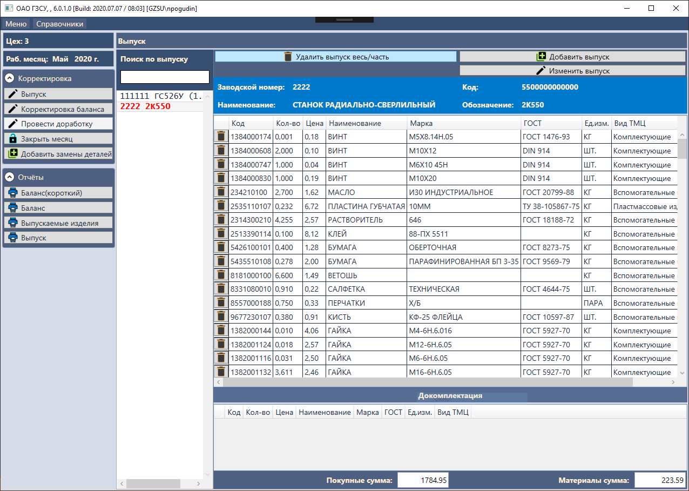
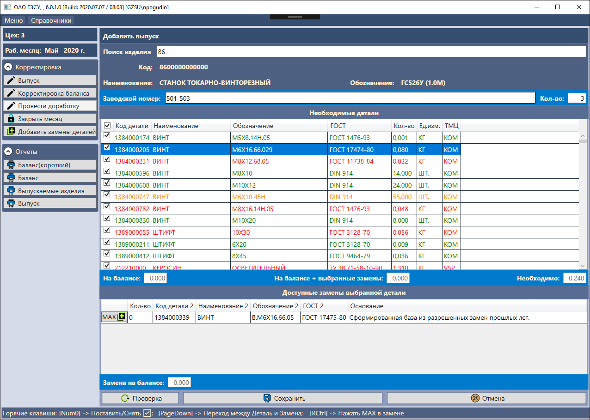
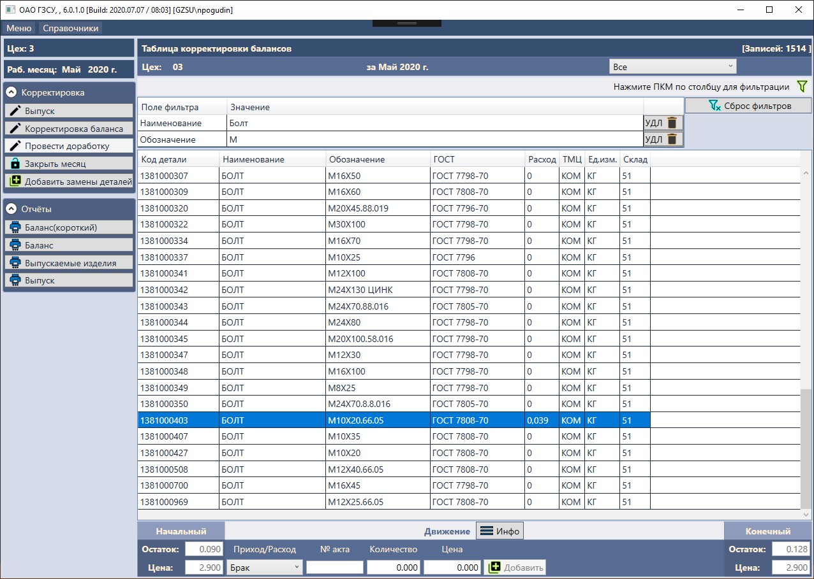
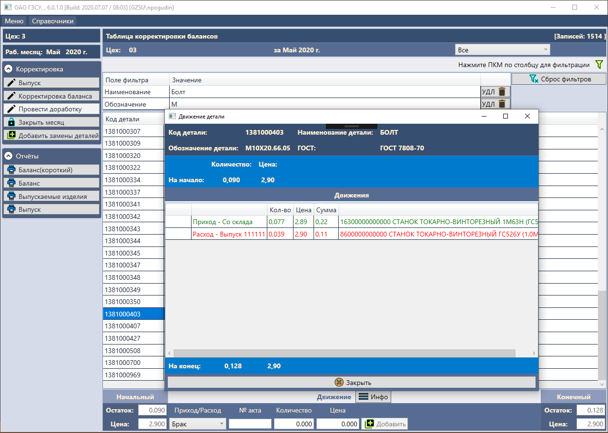
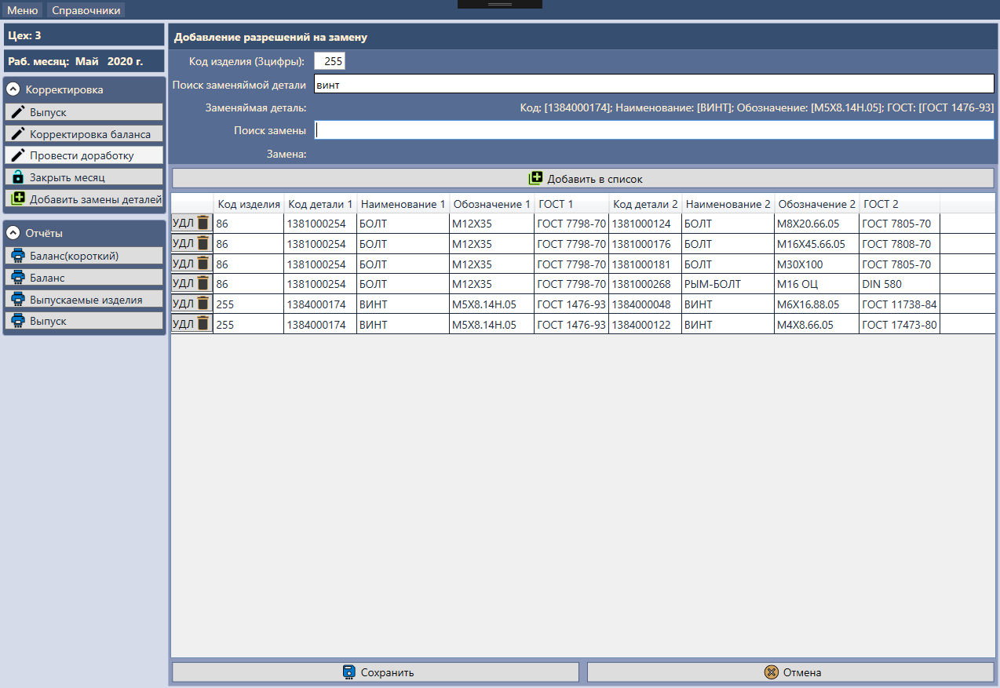
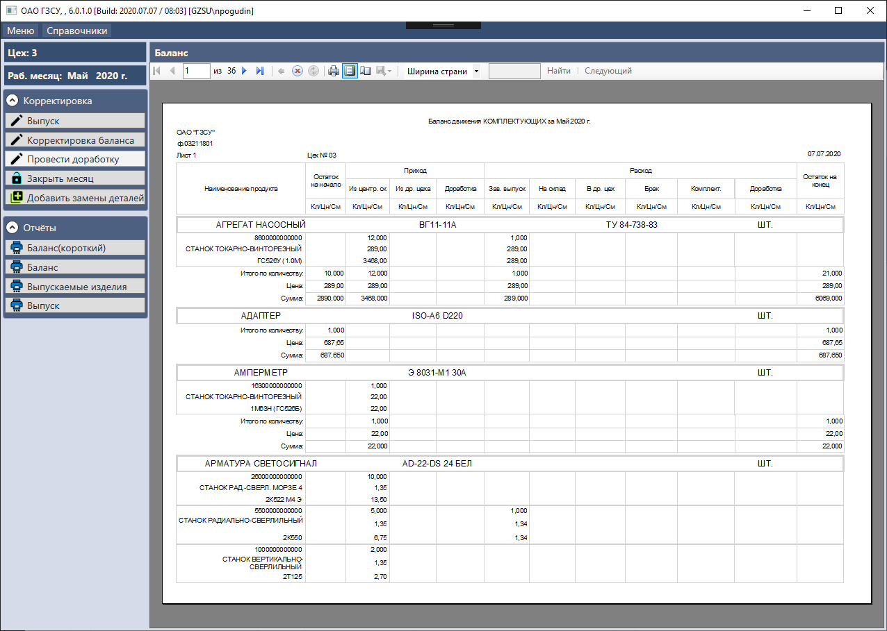
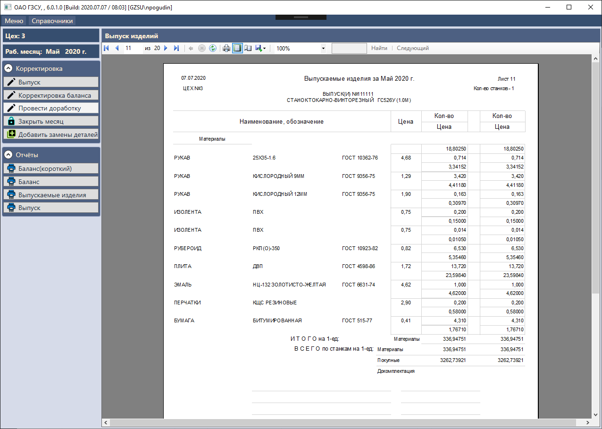
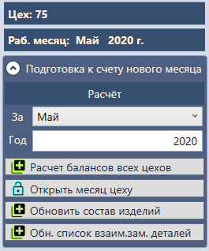

# ComponentBalanceSqlv2

Рабочее название: *ComponentBalance*  
Десктоп-приложение для учета баланса деталей в цехах предприятия.

### Требуемые базы данных:  
- Внутренняя база данных этого приложения **[ComponentBalanceDb]** (версию для разработки можно инициализировать скриптом)  
- Внешнии база данных предприятия (необходимы для расчета нового месяца).

### Параметры инициализации в IDE  
Параметры инициализации проекта на каждой машине разработчика (все файлы настроек описаны в .gitignore, дабы не перезатирать при каждом коммите): 

Параметр | Тип | Значение | Комментарий 
-------- | --- | -------- | -----------
FontSize               		| double | 15                   		| Размер шрифта
IsRunInFullscreen               | bool   | True                 		| Признак запуска приложения в полноэкранном режиме 
FoxProDbFolder_Composition      | string | w:\ComponentBalanceSqlv2\    	| Путь до таблиц с разрешенными заменами прошлых лет
FoxProDbFolder_Fox60_Arm_Limit  | string | v:\FOX60\arm\LIMIT\			| Путь до dbf таблиц лимиток предприятия 
FoxProDbFolder_Temp             | string | w:\ComponentBalanceSqlv2\Temp\   	| Путь до временных dbf таблиц приложения
FoxProDbFolder_Temp_Work        | string | w:\ComponentBalanceSqlv2\Temp\Work\  | Путь до временных вычислений в dbf таблицах приложения
FoxProDbFolder_Fox60_Arm_Base   | string | v:\FOX60\arm\BASE\    		| Путь до базовых dbf таблиц предприятия 
FoxproDbFolder_Skl              | string | v:\FOXPRO\SKL\       		| Путь до dbf таблиц складов предприятия 
FoxProDbFolder_FoxPro_Skl58     | string | v:\FOXPRO\SKL58\     		| Путь до dbf таблиц склада №58 предприятия

### Скриншоты окна настроек и рабочего приложения  

- Скриншот окна параметров IDE
  
- Скриншот окна настроек
  
- Скриншот окна выпущенных изделий
  
- Скриншот окна добавления выпуска изделия
 
- Скриншот окна корректировки баланса деталей цеха
   
- Скриншот окна информации движения конкретной детали в цеха
  
- Скриншот окна добавления разрешенных замен для деталей
  
- Скриншот отчета баланса деталей цеха
  
- Скриншот подробного отчета выпущенных изделий цеха
  
- Скриншот доп. функционала цеха №75 (отдела АСУП)
  
